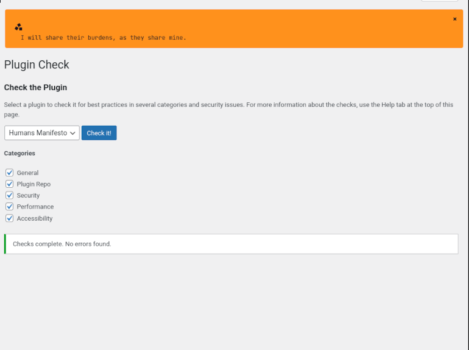

# Humans Manifesto

A lightweight WordPress plugin inspired by *Hello Dolly* and the movie *Ad Astra*. Displays random lines from the "Humans Manifesto" in a shared admin dashboard container.

## Features

- Displays a random manifesto line at the top of the WordPress admin dashboard.
- Shared container compatible with future **Human Manifesto** plugin.
- Supports translation (currently English and Serbian).
- Includes a button to hide the manifesto display.

## Installation

1. Upload the `humans-manifesto` folder to the `/wp-content/plugins/` directory.
2. Activate the plugin through the 'Plugins' menu in WordPress.
3. Enjoy a random line from the Humans Manifesto in your admin dashboard!

## Screenshots

## Translation

The plugin includes `.pot` and `.po` files for easy localization. Serbian translations are included.

## License

This plugin is licensed under the GPLv2 or later. See [license.txt](license.txt) for details.

## Author

Drago Katić  
[https://dragokatic.github.io/](https://dragokatic.github.io/)